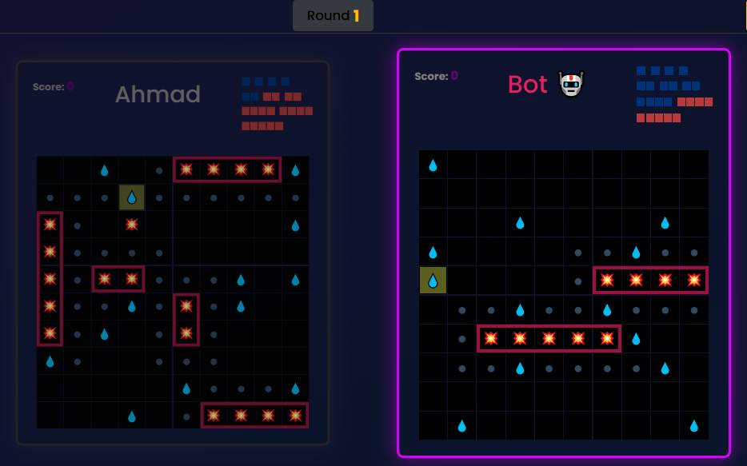

# Battleship

Browser-based implementation of the classic [Battleship game](<https://en.wikipedia.org/wiki/Battleship_(game)>).

**[Live preview](https://madany01.github.io/battleship/)**

## Screenshot

## Features

- **Non-cheating bot with state-machine driven 3-phase attack strategy**
- **Randomized automatic ship placement**
- **Three gaming modes:**
  - Player vs Bot
  - Player vs Player
  - Bot vs Bot
- **Variable ship sizes and board dimensions**

## Testing

- Game logic modules are developed following **Test-Driven Development (TDD)**, achieving near 100% test coverage

- **Coverage**:

  | Metric     | Percentage | Count     |
  | ---------- | ---------- | --------- |
  | Statements | 99.41%     | 1025/1031 |
  | Branches   | 94.94%     | 282/297   |
  | Functions  | 98.03%     | 100/102   |
  | Lines      | 99.41%     | 1025/1031 |

## Architecture

Clean separation of concerns:

- **Pure game logic**: [`src/game-modules`](./src/game-modules)
- **DOM rendering**: [`src/views`](./src/views)
- **Game loop**: [`src/createGameLoop.js`](./src/createGameLoop.js)
- Pub/Sub pattern for modular communication

### Bot Attacking System

- **Hunt-target** algorithm:
  1. Hunt Phase: Random probing until first hit
  2. Target Phase:
  - Adjacent exploration (after first hit)
  - Directional pursuit (after second hit)
- **Efficiency**: O(1) decision-making after target lock
- **Non-cheating** (uses same board information as the human players)

### Randomized Ship Placement

- **Dynamic programming** approach:
  - Pre-calculates valid placement zones
  - Memoizes failed configurations
- **Pruning**:
  - Eliminates invalid branches early
  - Depth-first search with backtracking
- Buffer zone enforcement (1-cell minimum spacing)

## Technologies

Built from scratch with HTML, CSS, and JavaScript.

## UI

- **Responsive design**
- Drag-and-drop ship placement with collision prevention
- Visual indicators
  - Hit/miss/sink shots
  - Blocked buffer zones
- Auto-blocking of invalid attack zones
- Surrounding ship's hit parts (buffer zone visualization)
